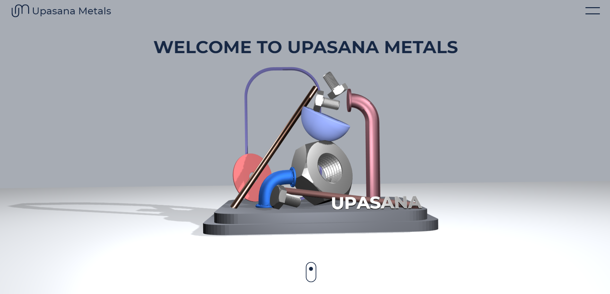

# Private E-commerce With Firebase


## Introduction
This is the private e-commerce platform with firebase as BaaS, which deals with metal selling via an commissioned committee.

Purchase Company is the one who produces the large amount of metals and wants to sale it (_**Note**: They cannot directly sale to the sales company_).

Sales Company is the one which are the retailers or wholesellers and want to buy the metal via this platform (_**Note**: They cannot directly buy from the purchase company_).

## How to use 

Fork this Project and clone it locally.

Install the firebase package globally or run:

```
    npm install
```

## Demo
Check out the live demo hosted on firebase itself

<https://upasana-metals.web.app/>

## Details
This website is developed for a metal company. Here purchase company sales the metal on the platform and Sales company buys the metal from the platform.

Register the company under purchase or sales company and you will be redirected to their designated page. 

### Workflow: 
1. The homepage for sales companies will be the inquiry page where one can request the quotation of the desired description and that will stored in firestore and then forwarded to all the purchase companies.

1. The homepage for purchase company will be the details page where one gets the info of forwarded inquiry, if the company can fulfill the requirement then they can send the quotation regarding it on the next page. This quotation will be stored in the firestore.

1. Then the latest suggested quotation is sent to the sales company's details page with pre-added commission of this platform as 5% of the total amount of quotation.

1. Sales company can check the quotation info from its page in menu. If they wish to buy the metal by paying the displayed amount then by clicking on buy option, the order gets confirmed.

1. Purchase company now gets the ping about the order confirmation and can check from the menu. After entering the details, they click on confirm and final order gets placed.


## Authors

+ [Dhruval Raval](https://www.linkedin.com/in/dhruval-raval/)
  - Fullstack Lead Developer, 3D modelling
+ Deep Raval
  - Fullstack Lead Developer
+ [Neel Vadgama](https://www.linkedin.com/in/neel-vadgama-b02449159/)
  - Frontend Developer 
+ [Het Kadia](https://www.linkedin.com/in/het-kadia-9614251b2/)
  - Frontend Developer 
+ [Rutvik Gaudani](https://www.linkedin.com/in/rutvik-gaudani-6b86b71b5/)
  - Frontend Developer

## Mentor 

[Vrunda Gadesha](https://www.linkedin.com/in/vrunda-gadesha-45441349/)
    
  
